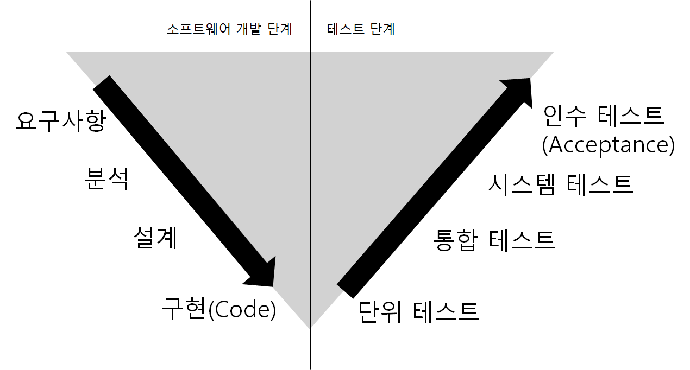

# locus-back-end
Amazon Location Service 리버스 엔지니어링을 통한 구현 프로젝트

> https://aws.amazon.com/location/

### ``서비스 구분``

#### Maps

#### Places

#### Routes

#### Trackers

#### Geofences

### ``개발 프로세스``

1. 요구사항을 분석하여 인수 항목을 정의
2. 

#### 1. 문서화는 최소화, 최대한 개발 코드로 문서화를 대체

### ``개발 환경``

#### 언어
- java (jdk 17)

#### 프레임워크
- spring boot (...)

#### DBMS
- mysql (...)
- mongodb (...)
- kafka (...)
- redis (...)

#### container
- docker (...)

### ``시스템 구성도``